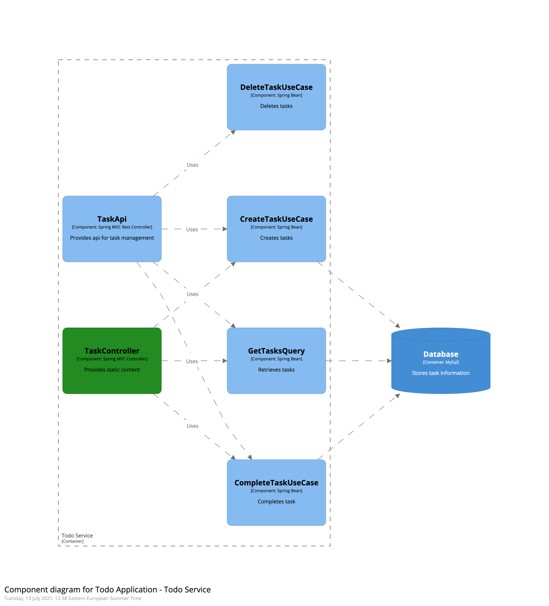

# Example Implementation of a Hexagonal Architecture

Simple TODO application which domain-centric "Hexagonal" approach of a common web application with Java and Spring Boot.

## C4 visualisation:

### Context:

### Container:

### Component:
